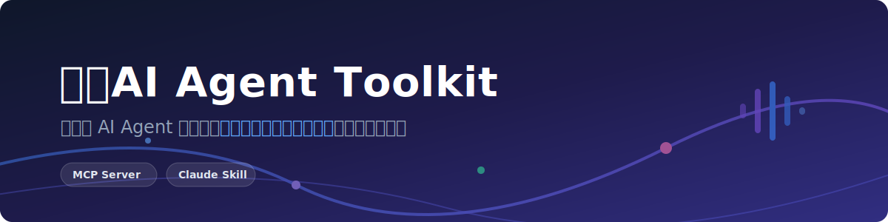

<div align="center">
  

  <br/>
  <br/>

  **让你的 AI Agent 拥有一支会思考、会说话、能成交的数字员工团队**

  [English](README.md) | [简体中文](README.zh.md)

  <br/>

  [](https://www.npmjs.com/package/smartcall-agent-toolkit)
  [](LICENSE)

  <br/>

  [官网](https://halfcall.cn) · [控制台](https://halfcall.cn/dashboard) · [International](https://onvocall.com)

</div>

<hr/>

<br/>

# 事半AI Agent Toolkit — 给你的 Agent 一支数字员工团队

## 这是什么？

事半AI 是[事半科技](https://halfcall.cn)打造的 **AI 数字员工平台**。每一个数字员工都由大模型驱动，具备上下文记忆、随意打断、复杂推理、情绪感知、主动倾听、无感转人工的能力。它可以是你的销售经理、企业客服、医患助手、市场营销专员 — 7x24 小时不间断工作。

打电话只是数字员工的其中一项技能。它们能进行真实的电话对话：开场白、产品介绍、异议处理、感知语气变化、实时调整策略、判断意向。全程无需人工介入，企业级并发。

**事半AI Agent Toolkit** 把这些能力交给你的 AI Agent。不管你用 Claude、GPT 还是任何支持 MCP 的 Agent，都能直接部署数字员工、推送线索、实时调整话术、接收通话结果。

不用登后台。不用手动上传 Excel。告诉你的 Agent 一句话，数字员工就开始工作了。

## 为什么选事半AI？

传统外呼靠人工，慢、贵、机械。事半AI 的数字员工完全不同：

- **真的在思考** — 接入主流大模型，支持上下文记忆和复杂推理。不是录音播放，是完整的对话和决策。
- **随意打断** — 用户可以随时插话，数字员工瞬间调整，像跟真人聊天一样自然。
- **情绪感知** — 实时感知语气情绪，动态调整对话策略和语速节奏。生气了放慢，感兴趣了推进。
- **企业级并发** — 同时跑几百通电话，多个数字员工并行工作，不排队。
- **无感转人工** — 需要真人介入时，平滑交接，不会有尴尬的断裂感。
- **Agent 原生** — 为 AI Agent 时代设计。你的 Agent 控制整个生命周期。

## 数字员工能做什么？

你的 AI Agent 通过事半AI 管理一支专业的数字员工团队：

- **拓客 AI 专员** — 把潜客名单推进去，数字员工帮你打 Cold Call 介绍产品。遇到异议它处理，判断意向它标注，打完你的 Agent 拿到一份按意向排好序的客户列表。话术效果不好？Agent 实时帮你改。

- **7x24 智能助理** — 全天候在线。接听客户咨询，解答常见问题（价格、功能、文档链接），记录无法解决的问题，需要时无感转接真人。每一次对话都有记录。

- **续费挽留专员** — 订阅到期前主动联系客户。提供续费优惠，收集流失原因，标记高风险账户。你的 Agent 实时监控续费率。

- **线索筛选专员** — 新注册用户、表单提交、入站咨询，全部推给数字员工。它打电话确认意向，你的 Agent 告诉你哪些该跟进、哪些再培育。

- **预约专员** — 患者名单、会员名单、客户名单推过去，数字员工打电话预约、确认、改期。你的 Agent 追踪确认率。

- **调研专员** — 大规模电话调研。在话术里定义问题，推送目标名单，Agent 帮你汇总结构化结果。

- **催缴专员** — 逾期账单、订阅续费、会费到期，AI 温和提醒。Agent 监控谁付了谁没付，没付的安排第二轮。

- **活动邀约专员** — 电话邀请比邮件转化率高得多。推送几百个联系人，数字员工挨个打电话邀请，Agent 汇总谁确认参加。

- **沉睡唤醒专员** — 流失客户召回。Agent 推送长期未活跃用户，数字员工用个性化方案重新触达，看谁愿意回来。

## 不只是打电话 — 完整的动作链

数字员工不只会说话，还会办事。每通电话的过程中和结束后，都能根据对话内容自动触发一连串动作：

### 通话中 — 实时动作

| 动作 | 怎么工作的 |
|------|-----------|
| **转接真人** | 检测到客户需要真人介入，通过 SIP 无感转接给人工坐席，不挂断不断线 |
| **发短信** | 通话过程中发送短信（验证码、产品链接、预约确认），支持阿里云、联路、闪海等多个通道 |
| **调用 API** | 通话中直接请求你的后端接口 — 查库存、查订单、创建 CRM 记录，你配什么它调什么 |
| **触发 Webhook** | 通话中向任意 URL 发送请求 — 触发自动化流程、更新表格、通知频道 |

### 通话后 — 意向驱动的自动化

通话结束后，AI 自动分析对话内容，提取结构化数据，判定意向等级，然后按规则推送：

```
通话结束 → AI 分析意向 → 按意向分发
                ├── 高意向  → 推企微群 + 自动加微信好友
                ├── 犹豫    → 推飞书群 @负责人跟进
                ├── 创建工单 → 推钉钉群分配处理
                └── 所有结果 → POST 话单到你的服务器 API
```

| 动作 | 怎么工作的 |
|------|-----------|
| **推企业微信** | 意向卡片推到企微群 — 显示意向等级、通话时长、提取字段、录音链接，自动 @负责销售 |
| **推飞书** | 富文本卡片推到飞书群 — 通过飞书应用 API 按手机号 @对应负责人，包含全部客户数据 |
| **推钉钉** | Markdown 消息推到钉钉群 — HMAC-SHA256 签名，支持 @指定人 |
| **推你的服务器** | 结构化话单（手机号、意向、时长、提取字段、录音 URL）POST 到任意 API。支持 Bearer/Basic/API Key 认证、HMAC 签名、IP 白名单，自动重试 3 次 |
| **自动加微信** | 高意向通话结束后，通过企业微信自动发送好友申请 |
| **创建工单** | 生成跟进工单，包含客户信息，推送到飞书/微信/钉钉群分配处理 |

所有推送都有指数退避重试（2 秒 → 4 秒 → 8 秒，最多 3 次）。失败的推送由后台调度器每分钟扫描重试。

### 完整流程

```
1. 配置密钥     2. 部署数字员工     3. 通话 + 动作        4. 意向推送
┌─────────┐    ┌──────────┐       ┌──────────────┐      ┌──────────┐
│ 配好     │───>│ Agent    │──────>│ 数字员工      │─────>│ AI 分析   │
│ API Key  │    │ 部署数字 │       │ 打电话，      │      │ 意向提取  │
│          │    │ 员工     │  ☎️   │ 通话中可以：  │      │ 然后推送: │
│          │    │          │─>📞─>│ · 发短信      │      │ · 企微群  │
│          │    │          │       │ · 转人工      │      │ · 飞书群  │
└─────────┘    └──────────┘       │ · 调 API     │      │ · 钉钉群  │
                                   │ · Webhook    │      │ · 你的API │
                                   └──────────────┘      │ · 加微信  │
                                                          └──────────┘
```

1. **Agent 推送线索** — 手机号 + 可选变量（姓名、公司、打电话的原因）
2. **数字员工自动拨打** — 按配好的话术进行自然对话，具备情绪感知和主动倾听
3. **通话中动作自动触发** — 发短信、转人工、调你的 API，话术怎么配它就怎么做
4. **通话后流水线启动** — AI 提取意向，推企微/飞书/钉钉/你的服务器，创建工单，自动加好友

你的 Agent 有了一支不只会说话，还会办事的数字员工团队。

## 快速开始

### 方式 A：MCP Server

适用于 Claude Desktop、Claude Code 或任何 MCP 兼容客户端。

**Claude Desktop** — 添加到 `claude_desktop_config.json`：
```json
{
  "mcpServers": {
    "smartcall": {
      "command": "npx",
      "args": ["-y", "smartcall-agent-toolkit"],
      "env": {
        "SMARTCALL_API_KEY": "sk-你的密钥"
      }
    }
  }
}
```

**Claude Code** — 添加到 `.mcp.json` 或 `~/.claude/mcp.json`：
```json
{
  "mcpServers": {
    "smartcall": {
      "command": "npx",
      "args": ["-y", "smartcall-agent-toolkit"],
      "env": {
        "SMARTCALL_API_KEY": "sk-你的密钥"
      }
    }
  }
}
```

### 方式 B：Claude Code Skill

```bash
git clone https://github.com/smart-aicall/agent-toolkit.git ~/.claude/skills/smartcall
```

在 Claude Code 里输入 `/smartcall` 即可激活。

### 获取 API Key

在 [halfcall.cn](https://halfcall.cn)（国内）或 [onvocall.com](https://onvocall.com)（海外）注册，进入 **设置 > API 密钥**，创建新密钥。

## 你的 Agent 能做什么

### 5 大类 17 个工具：

**认证**
| 工具 | 干什么的 |
|------|---------|
| `verify_auth` | 检查 API Key 是否有效，属于哪个企业 |

**线索管理**
| 工具 | 干什么的 |
|------|---------|
| `push_lead` | 把手机号推给数字员工，自动拨打 |
| `query_lead` | 查一通电话的结果：接了没？聊了多久？意向如何？ |
| `batch_query_leads` | 批量查几百条线索，按日期、项目、ID 筛选 |

**项目管理**
| 工具 | 干什么的 |
|------|---------|
| `list_programs` | 看所有项目和它们的数字员工 |
| `control_program` | 一条命令启动或暂停项目 |
| `get_program_stats` | 今天的数据：打了多少、接通率、意向分布 |
| `get_dialing_config` | 当前配置：并发多少、什么时间段、什么优先级 |
| `update_dialing_config` | 调参数：加并发、改时段、换策略 |

**数字员工管理**
| 工具 | 干什么的 |
|------|---------|
| `list_bots` | 看项目里有哪些数字员工 |
| `get_bot_script` | 读话术：数字员工怎么思考和说话的 |
| `update_bot_script` | 改话术：改完下一通电话立刻生效 |
| `download_lead_template` | 下载批量导入线索的 CSV 模板 |

**Webhook 回调**
| 工具 | 干什么的 |
|------|---------|
| `get_webhook` | 看有没有配实时回调 |
| `update_webhook` | 配一个 URL，每通电话打完自动 POST 结果过去 |

## 跟你的 Agent 说人话就行

> "把这 50 个手机号推给销售数字员工，有结果了告诉我。"

> "今天续费项目跑得怎么样？接通率多少？"

> "数字员工开场白太生硬了，拿出来改一下，语气自然点。"

> "配个 webhook，每通电话结果推到我们的飞书。"

> "暂停催收项目，已经下班了。"

> "把昨天的高意向客户全拉出来看看。"

## 环境变量

| 变量 | 必填 | 默认值 | 说明 |
|------|------|--------|------|
| `SMARTCALL_API_KEY` | 是 | — | 控制台里拿的 API 密钥 |
| `SMARTCALL_BASE_URL` | 否 | `https://api.halfcall.cn` | API 地址 |
| `SMARTCALL_TIMEOUT` | 否 | `30000` | 请求超时（毫秒） |

## 本地开发

```bash
git clone https://github.com/smart-aicall/agent-toolkit.git
cd agent-toolkit
npm install
npm run build

# 本地运行
SMARTCALL_API_KEY=sk-xxx npm start
```

## 关于我们

事半AI Agent Toolkit 由[事半科技](https://halfcall.cn)开源维护。

事半AI 打造会思考的数字员工。让每个企业都能拥有自己的数字员工团队。

- 国内站：[halfcall.cn](https://halfcall.cn)
- 海外站：[onvocall.com](https://onvocall.com)

## 开源协议

[MIT](LICENSE)
